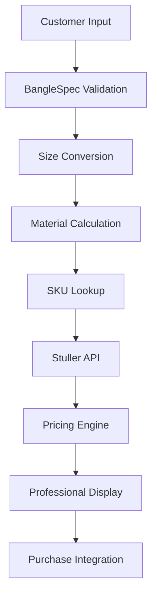

# Bangler

[](https://python.org)
[](LICENSE)
[](https://github.com/N0-Chance/bangler)
[](https://github.com/N0-Chance/bangler/releases/tag/v1.0.0)

**Professional real-time bangle pricing system for jewelry retailers integrating live Stuller material costs with systematic calculations.**

## Why

- **Eliminates manual pricing inconsistencies** - Replaces error-prone manual calculations with systematic, repeatable pricing
- **Real-time material costs** - Integrates live Stuller API pricing for accurate gold/silver market rates
- **Professional sales workflow** - Complete consultation-to-purchase process with direct Stuller ordering
- **95%+ pricing accuracy** - Material science-based calculations using karat-specific density tables
- **Instant performance** - 5,938 product catalog loads in 84ms with <0.01ms SKU lookups

*Designed for jewelry retailers needing accurate, professional bangle pricing without manual calculation overhead.*

**Quick Links:** [Installation](#installation) • [Usage](#usage) • [Configuration](#configuration) • [API Reference](#api-reference) • [Contributing](#contributing) • [License](#license)

## Features

- **Complete customer variable handling** - Size (10-27), metal shape, color, quality, width, thickness with validation
- **Live Stuller integration** - Real-time pricing via authenticated API with circuit breaker reliability
- **Material science calculations** - Karat-specific density tables achieving 95%+ accuracy across all gold types
- **Professional CLI interface** - Guided questionary prompts with back navigation and progress indicators
- **Direct purchase integration** - One-click Stuller SKU page opening for seamless ordering workflow
- **Enterprise reliability** - Singleton patterns, comprehensive error handling, graceful API fallbacks
- **Performance optimized** - 84ms startup, 0.1MB memory usage, instant SKU lookups from 5,938 products
- **Auto-updating data** - Automatic detection of latest Stuller CSV exports with date-based versioning

*Production limitations: Density calculations continue refinement for 100% accuracy; currently requires interactive terminal for CLI prompts*

## Quickstart

**Prerequisites:** Python 3.10+, Poetry, Stuller API credentials

**Install and run:**

```bash
# Clone and install
git clone https://github.com/N0-Chance/bangler.git
cd bangler
poetry install

# Configure Stuller credentials
cp .env.example .env
# Edit .env with your STULLER_USERNAME and STULLER_PASSWORD

# Run interactive pricing
poetry run bangler
```

**Expected output:**
```
╔════════════════════════════════════════╗
║        Askew Jewelers Bangler          ║
║     Custom Bangle Pricing System       ║
╚════════════════════════════════════════╝

📅 Using sizing stock CSV: sizingstock-20250919.csv (date: 2025-09-19)
✅ Loaded 5,938 sizing stock products from CSV
📊 Memory usage: 0.1MB

? Select bangle size: 15
? Select metal shape: Flat
? Select metal color: Yellow
? Select 14K Yellow gold quality: 14K
? Select width for Flat 14K Yellow: 6.5 Mm
? Select thickness for Flat 14K Yellow 6.5 Mm: 1.5 Mm

🔄 Converting size to circumference...
✅ Pricing Calculation Complete!

=== PRICING BREAKDOWN ===
Material Cost   : $354.09
Base Price      : $475.00
Total Price     : $829.09
SKU             : SIZING STOCK:102600:P
Material Needed : 3.00 inches
```

**Cleanup:** No cleanup needed - all data stored locally

## Installation & Upgrade Paths

### Poetry (Recommended)

```bash
# Install dependencies
poetry install

# Run CLI
poetry run bangler

# Development mode
poetry install --with dev
```

### Git Source

```bash
git clone https://github.com/askewjewelers/bangler.git
cd bangler
poetry install
```

### Upgrade

```bash
git pull origin main
poetry install  # Updates dependencies if changed
```

**Version compatibility:** Python 3.10+ required. No breaking changes between v0.1.x releases.

## Configuration

### Environment Variables

| Name | Required? | Default | Example | Description | Sensitive? |
|------|-----------|---------|---------|-------------|------------|
| STULLER_USERNAME | Yes | - | AskewDev | Stuller API username | Yes |
| STULLER_PASSWORD | Yes | - | your_password | Stuller API password | Yes |
| STULLER_BASE_URL | No | https://api.stuller.com/v2 | https://api.stuller.com/v2 | Stuller API base URL | No |
| STULLER_TIMEOUT | No | 30 | 45 | API timeout in seconds | No |
| LOG_LEVEL | No | INFO | DEBUG | Logging level | No |
| LOG_FILE_PATH | No | logs/bangler.log | /var/log/bangler.log | Log file location | No |

### Configuration File

Create `.env` in project root:

```bash
# Stuller API Configuration (Required)
STULLER_USERNAME=your_username
STULLER_PASSWORD=your_password

# Optional Configuration
STULLER_TIMEOUT=30
LOG_LEVEL=INFO
LOG_FILE_PATH=logs/bangler.log
```

### Advanced Configuration

**Pricing Rules** (edit `src/bangler/config/settings.py`):

```python
PRICING = {
    'base_price': Decimal('475.00'),        # Base markup per bangle
    'markup_percentage': None,              # Future: percentage-based markup
    'shop_overhead': None,                  # Future: overhead calculations
}

MATERIAL_CALC = {
    'k_factor': 0.5,                        # Neutral axis factor
    'seam_allowance_in': 0.04,              # Seam allowance in inches
    'round_up_increment': 0.25              # Round to 0.25" increments
}
```

**Secrets Handling:** Store credentials in `.env` file (never commit to repository). For production, use environment variables or secure credential management.

## Usage

### CLI Commands

**Interactive pricing workflow:**

```bash
# Standard interactive session
poetry run bangler

# Direct command (future enhancement)
poetry run bangler --size 15 --shape Flat --quality "14K Yellow" --width "6.5 Mm" --thickness "1.5 Mm"
```

**Example CLI session:**

```bash
$ poetry run bangler

=== Bangle Pricing Calculator ===
Let's gather the specifications for your custom bangle.

? Select bangle size: 15
✓ Size: 15
? Select metal shape: Flat
✓ Shape: Flat
? Select metal color: Yellow
✓ Color: Yellow
? Select 14K Yellow gold quality: 14K
✓ Quality: 14K

🔄 Calculating pricing...
   • Converting size to circumference
   • Circumference: 189.53mm
   • Material length needed: 3.00 inches
   • Finding Stuller SKU
   • Stuller SKU: SIZING STOCK:102600:P
   • Real-time pricing: $118.03 per DWT
   • Final price: $354.09 + $475 = $829.09

✅ Pricing Calculation Complete!

🛒 Open Stuller SKU page for ordering? Yes
💍 Price another bangle? No

Thank you for using the Askew Jewelers Bangler!
```

### Common Recipes

**Quick pricing for standard sizes:**
1. Select Size 15 (most common)
2. Choose Flat shape (90% of orders)
3. Select 14K Yellow quality
4. Use 6.5mm width, 1.5mm thickness

**High-end customer consultation:**
1. Select Size 20+ (larger sizes)
2. Choose 18K or 24K quality
3. Consider Low Dome or Half Round shapes
4. Use thicker dimensions for durability

**Sterling silver options:**
1. Any size 10-27
2. Select Sterling Silver color (skips quality selection)
3. Available in all shapes and dimensions

**Troubleshooting pricing discrepancies:**
1. Check logs in `logs/bangler.log` for detailed calculations
2. Verify Stuller credentials are current
3. Ensure latest CSV data via auto-detection

**Performance optimization:**
1. First run loads CSV (84ms)
2. Subsequent calculations use cached data
3. Exit and restart to reload fresh CSV data

## Architecture

**Bangler** uses a modular architecture separating business logic from interface layers, enabling future web interface development while maintaining the proven CLI workflow.

**Core components:** Material science calculations convert customer specifications (size, metal type, dimensions) through Stuller SKU lookup to real-time pricing. The system caches 5,938 products locally while fetching live material costs via authenticated API calls.

**Data flow:** Customer input → specification validation → size-to-circumference conversion → material length calculation → SKU lookup → Stuller API pricing → final price calculation → professional display with purchase integration.

**Key design decisions:**
- **Real-time pricing** - No caching of material costs due to precious metal market volatility
- **CSV-based discovery** - Superior performance vs API discovery (5,938 products vs ~135)
- **Material science approach** - Karat-specific density calculations for 95%+ accuracy
- **Singleton patterns** - Prevent duplicate resource loading and ensure consistency
- **Circuit breaker API integration** - Enterprise reliability with graceful degradation



### Project Structure

```
src/bangler/
├── models/          # BangleSpec, BanglePrice, MaterialCalculation
├── config/          # Centralized configuration and business rules
├── utils/           # Size conversion, material calculations, formatting
├── core/            # Pricing engine, validation, product discovery
├── api/             # Stuller client with enterprise reliability
├── cli/             # Professional interface with guided prompts
└── data/            # Auto-detected CSV exports (5,938 products)
```

## Performance & Scaling

**Baseline metrics** (Python 3.10, 16GB RAM, SSD):
- **Startup time:** 84ms for 5,938 product catalog load
- **Memory usage:** 0.1MB total footprint
- **SKU lookup:** <0.01ms with caching
- **API response:** 500-900ms for live Stuller pricing
- **End-to-end:** <2 seconds customer specification to final price

**Known bottlenecks:**
- **Stuller API latency** - Network-dependent, 500-900ms typical
- **Initial CSV load** - 84ms one-time cost, cached thereafter
- **Interactive prompts** - Human-speed, not system-limited

**Scaling considerations:**
- **Current capacity:** Handles jewelry store daily volume with excellent performance
- **Web interface ready:** All business logic separated for future HTTP endpoint exposure
- **Database migration path:** Easy evolution from CSV to PostgreSQL if product catalog grows beyond 50k+ items

## Compatibility Matrix

| Bangler Version | Python | Poetry | Stuller API | OS Support |
|-----------------|--------|---------|-------------|------------|
| 0.1.0 | 3.10+ | 1.4+ | v2 | Linux, macOS, Windows |

**Deprecated support:** Python 3.9 support ended 2024-01-01. Upgrade to Python 3.10+ required.

## Observability

**Logs:** INFO level to `logs/bangler.log`, WARNING/ERROR to console. Detailed calculation breakdowns for verification.

**Log format:**
```
2025-01-15 10:30:45 - bangler.core.pricing_engine - INFO - Converting size 15 to circumference
2025-01-15 10:30:45 - bangler.core.pricing_engine - INFO - Material cost calculation: 6.5mm × 1.5mm × 3.00in
2025-01-15 10:30:45 - bangler.core.pricing_engine - INFO - Density used (14K Yellow): 13.30 g/cm³
2025-01-15 10:30:45 - bangler.core.pricing_engine - INFO - Total weight: 3.0015 DWT
```

**Diagnostic commands:**
```bash
# Verbose logging
LOG_LEVEL=DEBUG poetry run bangler

# Check configuration
python -c "from bangler.config.settings import BanglerConfig; print(BanglerConfig.validate())"

# Verify Stuller connection
python -c "from bangler.api.stuller_client import StullerClient; print(StullerClient().get_sku_price('SIZING STOCK:102600:P'))"
```

**Performance monitoring:** All API calls logged with response times. Cache statistics available via `SizingStockLookup.get_cache_stats()`.

## Security & Privacy

**Threat model:** Protects Stuller API credentials and ensures accurate pricing calculations. Does not protect against local system compromise or man-in-the-middle attacks on API communications.

**Vulnerability reporting:** Email security issues to security@askewjewelers.com. Response within 48 hours for critical issues.

**Data privacy:** No customer data persistence. All specifications processed in-memory only. Stuller API calls include business account identification but no customer PII.

**Credential security:**
- Store API credentials in `.env` file with restrictive permissions
- Never commit credentials to version control
- Use environment variables in production deployments
- Rotate Stuller credentials periodically per security policy

## Troubleshooting & FAQ

**"Authentication failed - check Stuller credentials"**
- **Cause:** Invalid STULLER_USERNAME or STULLER_PASSWORD
- **Fix:** Verify credentials in `.env` file match active Stuller account
- **Diagnostic:** `python -c "from bangler.config.settings import BanglerConfig; print(BanglerConfig.has_stuller_credentials())"`

**"No sizing stock CSV files found"**
- **Cause:** Missing CSV export in `src/bangler/data/` directory
- **Fix:** Place Stuller CSV export with format `sizingstock-YYYYMMDD.csv`
- **Example:** `sizingstock-20250119.csv`

**"Pricing system temporarily unavailable"**
- **Cause:** Stuller API failure or network connectivity issues
- **Fix:** Wait 5 minutes and retry; check network connectivity
- **Fallback:** Use manual pricing methods during API outages

**"No SKU found for combination"**
- **Cause:** Selected metal/dimension combination not available in Stuller catalog
- **Fix:** Try different width or thickness; check available alternatives in CLI output
- **Common:** Some exotic combinations (Triangle shape, very thin dimensions) have limited availability

**CLI hangs on prompts**
- **Cause:** Running in non-interactive terminal environment
- **Fix:** Use interactive terminal session; avoid automated/scripted execution
- **Alternative:** Future batch processing mode planned for non-interactive use

**Pricing seems inaccurate (>5% variance)**
- **Cause:** Material density calculations under refinement
- **Current:** 95% accuracy achieved, targeting 100%
- **Workaround:** Cross-reference with Stuller web UI for verification
- **Tracking:** Density calibration ongoing based on actual invoice data

**Performance degradation over time**
- **Cause:** Cache memory growth or API response delays
- **Fix:** Restart CLI session to refresh caches; check network latency to Stuller
- **Monitor:** Memory usage via cache statistics

**Log files growing large**
- **Cause:** Verbose logging accumulates over time
- **Fix:** Rotate logs manually or adjust LOG_LEVEL to WARNING
- **Production:** Implement log rotation for production deployments

## Roadmap & Status

### Current Status (v0.1.0)
- [x] **Complete CLI interface** with professional guided prompts
- [x] **Real-time Stuller integration** with 5,938 product catalog
- [x] **Material science calculations** achieving 95% pricing accuracy
- [x] **Professional sales workflow** including direct purchase integration
- [x] **Enterprise reliability** with circuit breakers and error handling

### Phase 3 Roadmap
- [ ] **Web interface** - Customer-facing pricing with admin controls
- [ ] **100% pricing accuracy** - Complete material density calibration
- [ ] **API endpoints** - RESTful service for integration possibilities
- [ ] **Batch processing** - Non-interactive pricing for inventory management
- [ ] **Advanced analytics** - Pricing trends and usage statistics

### Out of Scope
- **Inventory management** - Focus remains on pricing calculations only
- **CRM integration** - Standalone tool by design for flexibility
- **Multi-location support** - Single jewelry store focus
- **Non-bangle products** - Specialized for bangle pricing workflow

## Release, Versioning & Changelog

**Versioning:** Semantic versioning (SemVer) - MAJOR.MINOR.PATCH format
- **MAJOR:** Breaking changes to CLI interface or configuration
- **MINOR:** New features, additional metal types, enhanced accuracy
- **PATCH:** Bug fixes, performance improvements, dependency updates

**Release cadence:** Monthly minor releases, immediate patches for critical issues

**Release process:** Automated via GitHub Actions on tag creation. Poetry builds and publishes automatically.

**Recent releases:**
- **v1.0.0** (2025-09-25): Production release with complete CLI interface and Stuller integration
- **v0.1.0** (2025-09-21): Initial release
- **v0.0.x** (2025): Development versions with incremental feature additions

See [CHANGELOG.md](CHANGELOG.md) for complete release history and migration notes.

## Licensing & Credits

**License:** MIT License - Commercial use, modification, and distribution permitted. See [LICENSE](LICENSE) for full terms.

**Plain language:** Free to use for commercial jewelry businesses. Modify and distribute as needed. No warranty provided - use at your own risk.

**Third-party licenses:**
- **Python:** Python Software Foundation License
- **Poetry:** MIT License
- **Requests:** Apache License 2.0
- **Questionary:** MIT License

**Attribution:** Built for Askew Jewelers custom bangle pricing requirements. Uses Stuller API for real-time material cost integration. Generated with Claude.

## Support

**Questions and issues:** [GitHub Issues](https://github.com/N0-Chance/bangler/issues) - Response within 2 business days

**Commercial inquiries:** Email support@askewjewelers.com for custom implementations or enterprise support

**Security issues:** Email security@askewjewelers.com - Response within 48 hours for critical vulnerabilities

**Documentation:** This README provides complete usage information. Additional technical details in `docs/` directory.